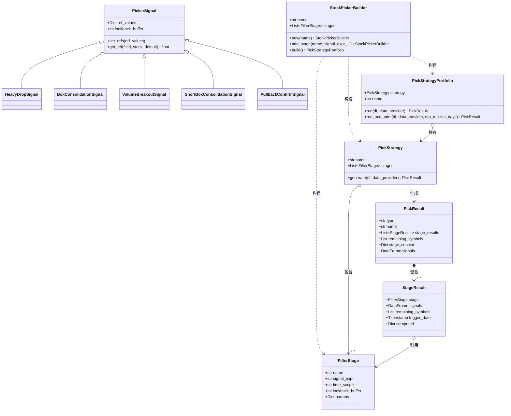

# Picker Framework — Filter Chain 选股框架

## 概述

Picker Framework 是一个**链式筛选（Filter Chain）** 选股框架。核心思想是将选股逻辑拆解为多个串联的筛选阶段（Stage），每个阶段应用一个或多个信号，逐步缩小候选股票池。

```
全量股票 → Stage1(信号A & B) → 过滤 → Stage2(信号C) → 过滤 → Stage3(信号D | E) → 结果
```

### 核心特性

- **Filter Chain 流式 API** — 通过 Builder 模式链式添加筛选阶段
- **跨阶段上下文引用** — 后阶段可通过 `{ctx.阶段名.key}` 引用前阶段的计算值
- **Per-stock ref_data 注入** — 后阶段信号自动获取前阶段触发日的 OHLCV 参考值
- **时间范围裁剪** — 支持 `full`（全量）和 `from_last`（从上阶段触发日开始）两种模式
- **自动 lookback_buffer** — 信号可声明需要多少历史回溯数据，框架自动保留
- **Numba 加速** — 内置信号使用 numba `@njit` 编译的高性能内核
- **自定义信号** — 继承 `PickerSignal` 即可编写自定义选股信号

## 架构

### 文件结构

```
picker/
├── __init__.py              # 模块入口，导出所有公开类
├── pick.py                  # 数据模型: FilterStage, StageResult, PickResult
├── picker_builder.py        # Builder: StockPickerBuilder（流式 API）
├── picker_strategy.py       # 核心引擎: PickStrategy（7 步执行流程）
├── picker_portfolio.py      # 组合器: PickStrategyPortfolio（运行 + 打印）
├── picker_signal.py         # 信号基类: PickerSignal（ref_values 传参）
├── picker_signals/
│   ├── box_strategy_signals.py   # 内置 5 个选股信号
│   └── box_strategy_numba.py     # 5 个 numba 加速内核
└── README.md                # 本文档
```

### 类图



### 核心数据模型

#### `FilterStage` — 筛选节点

```python
@dataclass
class FilterStage:
    name: str                # 节点名称，也是 ctx 中的 key
    signal_expr: str         # 信号表达式，如 "HeavyDrop() & BoxConsolidation()"
    time_scope: str = "full" # "full" | "from_last"
    lookback_buffer: int = 0 # from_last 时在触发日前额外保留的数据天数
    params: dict | None = None  # 额外占位符映射
```

#### `StageResult` — 单阶段执行结果

```python
@dataclass
class StageResult:
    stage: FilterStage              # 节点定义
    signals: pd.DataFrame | None    # bool DF (dates × symbols)
    remaining_symbols: list | None  # 该阶段剩余的股票
    trigger_date: Timestamp | None  # 首次触发日期
    computed: dict | None           # 统计值 + ref_data
```

#### `PickResult` — 完整选股结果

```python
@dataclass
class PickResult:
    type: str = "pick"
    name: str = ""
    stage_results: list | None = None
    remaining_symbols: list | None = None
    stage_context: dict | None = None  # {阶段名: {key: value}}
```

## 快速开始

### 安装依赖

```bash
pip install numpy pandas numba vectorbt
```

### 基础示例：单阶段选股

```python
from db.duckdb import DuckDBController
from db.db_common import DB
from db.stock_daily_util import get_CN_symbols, get_symbols_data
from vectorbt_test.engine.init import load_register_nodes
from vectorbt_test.engine.data_provider import DataProvider
from vectorbt_test.picker import StockPickerBuilder

# 1. 加载数据
load_register_nodes()
db = DuckDBController(DB)

symbols = get_CN_symbols(db)
df = get_symbols_data(db, ", ".join(symbols), "2022-01-01", "2026-06-11")
data_provider = DataProvider(None)

# 2. 构建选股链
picker = (
    StockPickerBuilder.new("大盘筑底")
    .add_stage("筑底", "HeavyDrop() & BoxConsolidation()")
    .build()
)

# 3. 执行
result = picker.run(data_provider, df)
print(result.remaining_symbols)  # 最终入选的股票列表
```

### 多阶段 Filter Chain

```python
picker = (
    StockPickerBuilder.new("箱体突破 5 阶段")
    .add_stage("筑底", "HeavyDrop()")                    # Stage1: 全量计算
    .add_stage("盘整", "BoxConsolidation()",              # Stage2: 从上阶段触发日开始
               time_scope="from_last")
    .add_stage("放量突破", "VolumeBreakout()",            # Stage3: 需40天回溯
               time_scope="from_last")
    .add_stage("回踩", "ShortBoxConsolidation()",         # Stage4: 自动获ref_data
               time_scope="from_last")
    .add_stage("确认", "PullbackConfirm()",               # Stage5: 自动获ref_data
               time_scope="from_last")
    .build()
)

# 运行并打印详细结果
result = picker.run_and_print(data_provider, df, top_n=10, kline_days=60)
```

## 详细指南

### 1. `add_stage()` 参数说明

```python
.add_stage(
    name,                  # str: 阶段名称，也是 ctx 引用时的 key
    signal_expr,           # str: 信号表达式
    time_scope="full",     # str: "full" | "from_last"
    lookback_buffer=0,     # int: from_last 时保留的额外回溯天数
    params=None,           # dict: 额外占位符映射 {key: "{ctx.阶段名.key}"}
)
```

### 2. 信号表达式

表达式支持 Python 语法，包括函数调用、组合运算、关键字参数：

```python
# 单个信号
"HighVolume()"

# 信号组合（与/或）
"HeavyDrop() & BoxConsolidation()"
"VolumeBreakout() | GapUp()"

# 自定义参数
"HeavyDrop(lookback_days=500, low_ratio=0.15)"
"BoxConsolidation(box_method='range', max_daily_amp=0.03)"

# 引用前阶段计算值（参见第4节）
"VolumeBreakout(from_date={ctx.筑底.trigger_date})"

# 混合用法
"HeavyDrop(low_ratio=0.3) | HeavyDrop(low_ratio=0.15)"
```

### 3. 时间范围控制 (`time_scope`)

| 模式 | 说明 | 适用场景 |
|------|------|----------|
| `"full"` | 使用全量时间范围的数据 | 需要长周期历史数据的信号（如 HeavyDrop 需回看 756 天） |
| `"from_last"` | 只保留从上阶段首次触发日到现在的数据 | 后续的信号只需要关注触发后的走势（如 BoxConsolidation、VolumeBreakout） |

```python
.add_stage("筑底", "HeavyDrop()")                      # full: 全量
.add_stage("盘整", "BoxConsolidation()",                # from_last: 从筑底触发日开始
           time_scope="from_last")
```

### 4. 跨阶段上下文引用 (`{ctx.阶段名.key}`)

后阶段可以通过 `{ctx.前阶段名.字段名}` 引用前阶段的计算值。

**可用字段**（由 `_extract_computed()` 自动提取）：

| 字段 | 类型 | 说明 |
|------|------|------|
| `trigger_date` | Timestamp | 首次触发日期 |
| `trigger_date_str` | str | 触发日期字符串 `"YYYY-MM-DD"` |
| `trigger_close` | float | 触发日选中股票的平均收盘价 |
| `trigger_high` | float | 触发日选中股票的平均最高价 |
| `trigger_low` | float | 触发日选中股票的平均最低价 |
| `trigger_volume` | float | 触发日选中股票的平均成交量 |
| `stock_count_before` | int | 本阶段开始前候选股票数 |
| `stock_count_after` | int | 本阶段筛选后剩余股票数 |

```python
.add_stage("筑底", "HeavyDrop() & BoxConsolidation()")
.add_stage("突破",
    "VolumeBreakout(from_date={ctx.筑底.trigger_date}, "
    "threshold={ctx.筑底.trigger_close})",
    time_scope="from_last")
```

### 5. Per-stock ref_data 注入

后阶段信号自动获取前阶段**触发日每只股票的 OHLCV**，用于比较或条件判断。

自动注入的字段：`high`、`low`、`close`、`volume`、`open`。

在信号中通过 `self.get_ref(field, stock, default)` 获取：

```python
class MySignal(PickerSignal):
    def compute(self, data, context):
        for stock in data["close"].columns:
            ref_high = self.get_ref("high", stock, default=np.inf)
            ref_low = self.get_ref("low", stock, default=-np.inf)
            # stock 的当前价在 ref_low ~ ref_high 之间
```

这与 `run_and_print()` 的打印配合——Stage4/5 自动从 Stage3 获取 ref_data，无需手动传参。

### 6. Lookback Buffer 机制

当使用 `from_last` 时，数据裁剪起点为 `last_trigger_date - lookback_buffer`。某些信号需要触发日期前的历史数据来计算移动平均线等指标。

**生效规则**：取 `stage.lookback_buffer` 和信号自身的 `lookback_buffer` 的**较大值**。

```python
# VolumeBreakoutSignal 内部声明 lookback_buffer=40
class VolumeBreakoutSignal(PickerSignal):
    def __init__(self, ...):
        super().__init__(lookback_buffer=40)  # 20日均量 + 20日检测窗口
```

框架自动处理：
```python
effective_lb = max(stage.lookback_buffer, signal.lookback_buffer)
# 裁剪时: from_date = last_trigger_date - timedelta(days=effective_lb)
```

### 7. 数据要求

输入数据必须是长格式（long format）DataFrame，包含以下列：

| 列名 | 类型 | 说明 |
|------|------|------|
| `symbol` | str | 股票代码 |
| `date` | datetime/date | 交易日期 |
| `open` | float | 开盘价 |
| `high` | float | 最高价 |
| `low` | float | 最低价 |
| `close` | float | 收盘价 |
| `volume` | float/int | 成交量 |

### 8. 结果查看

#### `run_and_print()` 输出示例

```
================================================================================
📊 Filter Chain 选股策略: 箱体突破 5 阶段
================================================================================

  Stage 1: [筑底] HeavyDrop()
    时间范围: full  |  之前 4603 只 → 之后 399 只  |  触发@2026-06-11

  Stage 2: [盘整] BoxConsolidation()
    时间范围: from_last  |  之前 392 只 → 之后 156 只  |  触发@2026-06-11

  ...

================================================================================
✅ 最终入选: 12 只
   股票列表: 000001.SZ, 000002.SZ, ...

  000001.SZ 近期 K 线:
  日期          开盘      最高      最低      收盘      成交量
  --------------------------------------------------------
  2026-05-20   12.34    12.56    12.20    12.45    1234567
  ...
```

#### 编程方式获取结果

```python
result = picker.run(data_provider, df)

# 最终股票列表
final_stocks = result.remaining_symbols

# 各阶段信号矩阵
stage1_signals = result.stage_results[0].signals

# 跨阶段上下文
ctx = result.stage_context
trigger_date = ctx["筑底"]["trigger_date"]
```

## 自定义信号

### 编写新信号

```python
from vectorbt_test.picker import PickerSignal
from vectorbt_test.core.context import PortfolioContext
from vectorbt_test.core.registry import NodeRegistry, NodeMeta, NodeParam

class HighVolumeSignal(PickerSignal):
    """
    放量信号 — 成交量大于均量 × 倍数。

    Args:
        vol_multiple: 成交量倍数阈值，默认 2.0
        vol_ma_days: 均量计算天数，默认 20
    """
    def __init__(self, vol_multiple: float = 2.0, vol_ma_days: int = 20):
        super().__init__()
        self._name = f"HighVolume_{vol_multiple}_{vol_ma_days}"
        self.vol_multiple = vol_multiple
        self.vol_ma_days = vol_ma_days

    def _args(self):
        return [self.vol_multiple, self.vol_ma_days] + super()._args()

    def compute(self, data, context: PortfolioContext):
        volume = data["volume"]
        return self._compute_multi(volume)

    def _compute_multi(self, volume):
        if isinstance(volume, pd.Series):
            return self._check_single(volume)
        result = pd.DataFrame(False, index=volume.index, columns=volume.columns)
        for col in volume.columns:
            result[col] = self._check_single(volume[col])
        return result

    def _check_single(self, volume: pd.Series) -> pd.Series:
        vol_ma = volume.rolling(self.vol_ma_days).mean()
        signal = (volume > vol_ma * self.vol_multiple).fillna(False)
        return signal.cummax()
```

### 注册到 NodeRegistry

```python
@GroupFuncReg.register(group="nodes")
def register_my_signals():
    NodeRegistry.register(
        "HighVolume",
        lambda vol_multiple=2.0, vol_ma_days=20:
            HighVolumeSignal(vol_multiple, vol_ma_days),
        NodeMeta(name="HighVolume", group="signal",
                 desc="成交量大于均量×倍数",
                 params=[
                     NodeParam("vol_multiple", "float", 2.0, "成交量倍数"),
                     NodeParam("vol_ma_days", "int", 20, "均量计算天数"),
                 ]),
    )
```

### 使用 ref_data 的信号

```python
class MyRefSignal(PickerSignal):
    """需要参考前阶段触发日 OHLCV 的信号。"""
    def compute(self, data, context):
        high = data["high"]
        low = data["low"]
        volume = data["volume"]
        return self._compute_multi(high, low, volume)

    def _check_single(self, high, low, volume) -> pd.Series:
        stock = high.name
        ref_h = self.get_ref("high", stock, np.inf)
        ref_l = self.get_ref("low", stock, -np.inf)
        ref_v = self.get_ref("volume", stock, 0.0)

        # 信号逻辑: 在 ref_high/ref_low 之间缩量震荡
        cond_high = high <= ref_h
        cond_low = low >= ref_l
        cond_vol = volume < ref_v * 0.5
        return (cond_high & cond_low & cond_vol).cummax()
```

## 内置信号

| 信号名 | 类 | 阶段 | 说明 |
|--------|-----|------|------|
| `HeavyDrop` | `HeavyDropSignal` | Stage1 (筑底) | 最低价≥60天前, 最低<最高×0.2, 最高≥120天前 |
| `BoxConsolidation` | `BoxConsolidationSignal` | Stage2 (盘整) | 箱体窄幅震荡, 日振幅<2%, 总振幅<10% |
| `VolumeBreakout` | `VolumeBreakoutSignal` | Stage3 (突破) | 涨幅>6%, 量>均量×3, 突破箱顶 |
| `ShortBoxConsolidation` | `ShortBoxConsolidationSignal` | Stage4 (回踩) | 2-5日缩量回调, 价在ref高低间 |
| `PullbackConfirm` | `PullbackConfirmSignal` | Stage5 (确认) | 二次放量大阳线, 涨幅>5%, 突破ref_close |

## 完整示例

完整的 5 阶段箱体突破选股示例见：

```bash
python -m app.vectorbt_test.example.picker_box_strategy_ex
```

## 设计原理

### 为什么是 Filter Chain？

传统的选股逻辑通常是将所有条件写在一个大的筛选表达式中，难以调试和维护。Filter Chain 将选股过程拆解为多个串联的阶段：

1. **每个阶段专注一个逻辑层次** — 筑底 → 盘整 → 突破 → 回踩 → 确认
2. **每阶段缩小范围** — 每个阶段减少搜索空间，提高后续阶段性能
3. **时间维度裁剪** — `from_last` 确保后阶段只关注触发后的数据，避免历史数据干扰
4. **上下文传递** — 前阶段的计算结果（触发日、价格等）自动传递给后阶段

### 执行流程（7 步）

```
Step 1: 用剩余股票过滤数据
Step 2: 解析 {ctx.前阶段.key} 占位符
Step 3: 构建 Signal 对象，提取 lookback_buffer
Step 4: 根据 time_scope 裁剪时间范围（含 lookback_buffer）
Step 5: 创建 PortfolioContext，注入 ref_data，评估信号
Step 6: 查找首次触发日期
Step 7: 提取 computed 和 ref_data，保存结果，传递到下一阶段
```
